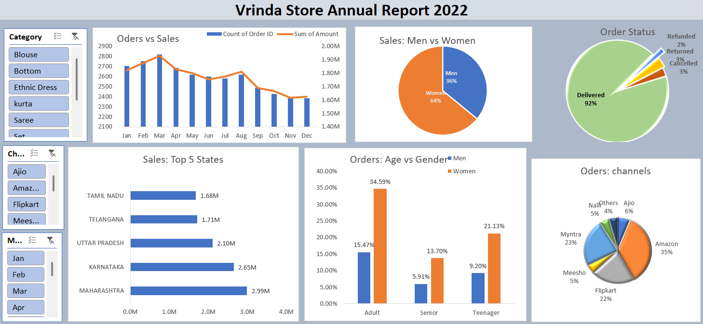

# Vrinda Store Annual Sales Analysis 2022 📊

## 📌 Objective
Vrinda Store wants to create an **Annual Sales Report for 2022** so that the company can understand customer behavior and grow sales in 2023.

---

## 🗂️ Dataset
- The dataset contains sales transactions for 2022.
- Columns include: Order ID, Date, Customer Details, Gender, Age, State, Sales Channel, Category, Amount, and Status.

---

## ❓ Business Questions Solved
1. Compare the sales and orders using a single chart.
2. Which month got the highest sales and orders?
3. Who purchased more — men or women in 2022?
4. What are different order statuses in 2022?
5. List the top 5 states contributing to the sales.
6. Relation between age and gender based on number of orders.
7. Which channel is contributing to maximum sales?
8. Highest selling category.

---

## 📈 Insights
- Women are more likely to buy compared to men (~65%).
- Maharashtra, Karnataka, and Uttar Pradesh are the top 3 states (~35% of sales).
- Adult age group (30–49 yrs) is the max contributing (~50%).
- Amazon, Flipkart, and Myntra are the top channels (~80% sales).

---

## 🎯 Final Conclusion
To improve Vrinda Store sales in 2023:
- **Target women customers** of age group (30–49 yrs)  
- Focus on **Maharashtra, Karnataka, and Uttar Pradesh**  
- Run ads, offers, and coupons on **Amazon, Flipkart, and Myntra**  

---

## 📊 Dashboard Preview

---

## 🚀 Tools Used
- Microsoft Excel
  - Data Cleaning
  - Pivot Tables
  - Charts
  - Dashboard creation

---

## 📥 Author
Name: Kulvant Dhaker
Email: dhakerkulvant@gmail.com